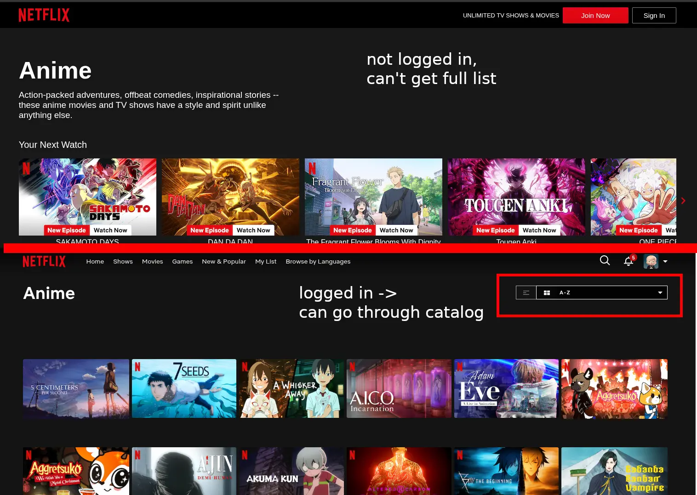
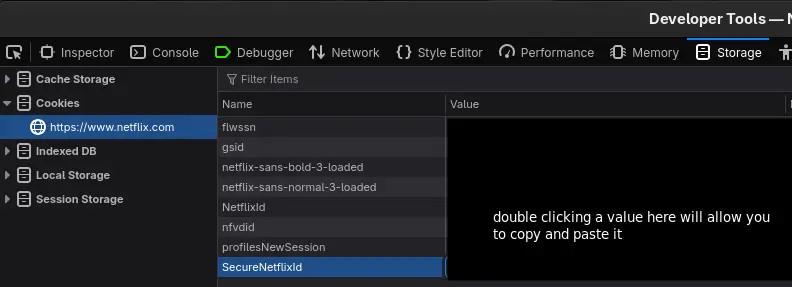
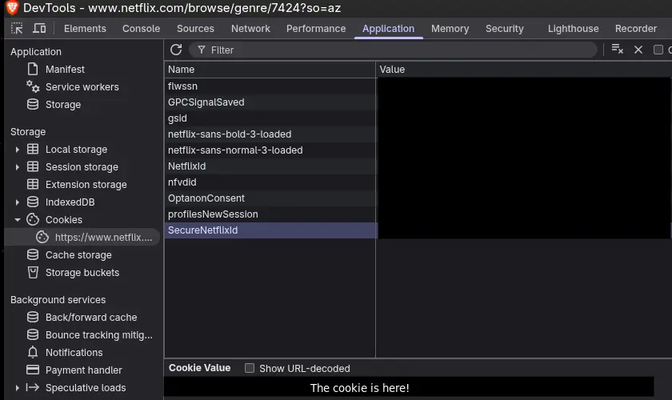

# Netflix

> [!CAUTION]
> Querying Netflix may violate the [Netflix Terms of Service]. Use at your own
> risk.

By default, this script skips querying Netflix, as you must be an authorized
user to see Netflix's catalog. To allow the script to fetch this data, you must
provide your Netflix session cookies as environment variables.

> [!WARNING]
> Your cookies act as your proof to Netflix that you are logged in. If someone
> else gets ahold of them, they can act as if they are you on Netflix's servers.
> Do not share them with anyone or any program if you do not understand what
> it is doing with them. Please read the code and make sure you trust what it
> is doing.

## Why is Authorization Necessary?

Netflix does not allow you to access a full A-Z list of titles unless you are
signed in. [When you are not logged in, this page gives you several categories,
but when you are logged in, the top right allows you to select an A-Z option.][anime]



I investigated the network calls the Netflix webapp makes to get this a-z
catalog, and this script emulates them, making one request for 48 titles per
second. This is how the webapp builds this catalog, and this script only makes
one request to Netflix per second, so I hope this is friendly enough to Netflix
to avoid causing any issues.

## How do I give my cookies to the script?

> [!WARNING]
> Your cookies act as your proof to Netflix that you are logged in. If someone
> else gets ahold of them, they can act as if they are you on Netflix's servers.
> Do not share them with anyone or any program if you do not understand what
> it is doing with them. Please read the code and make sure you trust what it
> is doing.

There are 4 steps:

1. Sign into Netflix in your browser to get valid session cookies

2. Put them in a `.env` file or in your terminal environment.

3. Run the script.

4. Log out of Netflix in your browser to invalidate those cookies so they cannot
   be used again, and erase them from your `.env` file.

### Getting Cookies from the Browser

First, go to [Netflix] and log in. Now, we'll extract your cookies from the browser.

#### Firefox-based Browsers



- In the browser menu, go to `More Tools > Web Development Tools.`
  Alternatively, use the `F12` or `Cmd+Shift+i` shortcut.

- Click on the Storage tab.

- On the bar on the left, under Cookies, click on `netflix.com`.

- Observe the entries named `SecureNetflixId` and `NetflixId`.

> [!WARNING]
> Do not share these with anybody.

- Under the Value field, double click the cookie to select it.
  You can now copy the cookie, either with `Ctrl-C` or by right
  clicking it and hitting Copy. You can paste the value [in the next
  step](#putting-them-in-your-terminal-environment).

#### Chrome-based Browsers



- In the browser menu, go to `More Tools > Developer Tools`. Alternatively, use
  the `F12` or `Cmd+Shift+i` shortcut.

- Click on the Application tab.

- On the bar on the left, under Storage, click on Cookies and `netflix.com`.

- Observe the entries labelled `SecureNetflixId` and `NetflixId`.

> [!WARNING]
> Do not share these with anybody.

- Click on each entry to select it. Make sure that "Show URL-decoded" is
  _not_ selected. You can copy paste the value from that box [in the next
  step](#putting-them-in-your-terminal-environment).

### Putting Them In Your Terminal Environment

The easiest way is to copy `.env.example` to `.env`. Then, paste the
`SecureNetflixId` and `NetflixId` cookies to their respective places.
Your `.env` file should look something like this:

```
SecureNetflixId=v%3D...
NetflixId=v%3D...
```

Alternatively, you can define the `SecureNetflixId` and `NetflixId`
environment variables in your terminal environment to avoid saving
the cookies in a text file.

### Run the Script

> [!CAUTION]
> Querying Netflix may violate the [Netflix Terms of Service]. Use at your own
> risk.

Run `pnpm start` to run the script. This uses the `.env` file by default.
Alternatively, you can run the script explicitly with `node --env-file=.env
src/netflix_pics/index.ts`. This also allows you to use a different file as your
env file.

### Invalidate the Cookies

**Once you're done, you must sign out of Netflix on your browser, and delete
the cookies from the `.env` file.**

By logging out, the cookies are no longer associated with your account. This
is an important step, because if you stay signed in, the cookies are still
valid for proving who you are. If that file with the cookies ever accidentally
gets published or leaked, anyone with that cookie gets access to your Netflix
account.

[Netflix Terms of Service]: https:/netflix_pics//help.netflix.com/netflix_pics/en/netflix_pics/legal/netflix_pics/termsofuse
[anime]: https:/netflix_pics//www.netflix.com/netflix_pics/browse/netflix_pics/genre/netflix_pics/7424
[Netflix]: https:/netflix_pics//netflix.com
